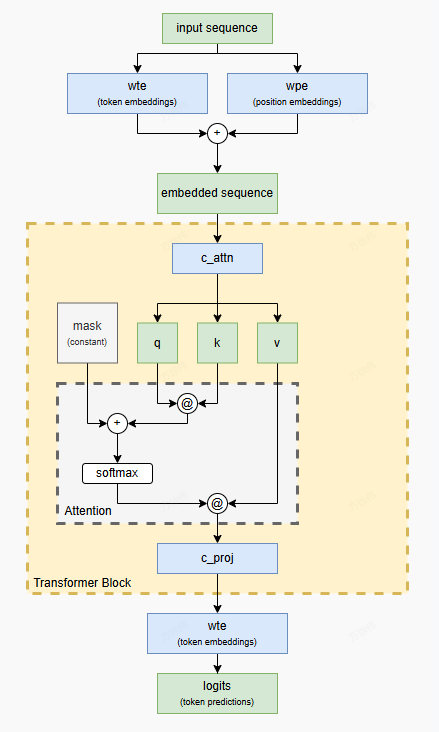

本文来自[I made a transformer by hand](https://vgel.me/posts/handmade-transformer/) . 一直以来，笔者对 transformer 的注意力机制、qkv的理解都浮于表面，当然也不是说我看完 [I made a transformer by hand](https://vgel.me/posts/handmade-transformer/) 后理解有多深入，但确实加深了我对相关概念的理解，故搬运此文章，部分表述基于笔者的理解加以修改。
手动制做一个Transformer来预测一个简单的序列，权重没有通过训练，而是手动分配。
要完成这个Transformer，基本步骤为：
1、选择一个任务
2、设计模型
3、设计位置嵌入和词嵌入矩阵
4、设计一个transformer block
5、使用之前的词嵌入矩阵，投影出下一个token的logits
# 一、选择任务
预测序列 `"aabaabaabaab..."` （也就是说 `(aab)*` ），这需要查询前两个 token 来知道输出应该是 `a` （前两个 token 是 `ab` 或 `ba` ）还是 `b` （前两个 token 是 `aa` ）。
## 设计 tokenization
由于只需要考虑两个符号，我们使用了一个非常简单的方案，其中 `a` 表示 `0` ， `b` 表示 `1` 
# 二、设计模型
基于[picoGPT/gpt2.py](https://github.com/jaymody/picoGPT/blob/main/gpt2.py). 架构图为：


## 2.1 选择模型维度
需要选择3个模型参数：
- Context length 上下文长度
- Vocabulary size 词汇量大小
- Embedding size 嵌入维度大小

Context length是模型一次能看到的最大标记数量。理论上这个任务只需要前两个标记——但这里我们选择 5，使其稍微困难一些，因为那样我们还需要忽略无关的标记。
Vocabulary size 是模型看到的不同token的数量。在一个实际模型中，泛化能力、需要学习的不同token的数量、上下文长度使用等方面存在权衡。然而，我们的任务要简单得多，我们只需要两个标记： a (0) 和 b (1)。
Embedding size 是模型为每个token/位置学习并内部使用的向量的尺寸，这里选择了 8.
# 三、设计位置嵌入和词嵌入矩阵
输入列表([0,1,0,...])转换为一个 seq_len x embedding_size 矩阵，该矩阵结合了每个词的位置和类型。于是我们需要设计 wte(token embeddings权重)和 wpe(position embeddings权重)，为每个使用独热编码。
使用前五个元素用于独热向量，位置 0 将表示为 [1, 0, 0, 0, 0]，位置 1 表示为 [0, 1, 0, 0, 0] ，依此类推，直到位置 4 表示为 [0, 0, 0, 0, 1] 。使用接下来的两个元素表示词嵌入独热向量， token a 将表示为 [1, 0] ，而 token b 将表示为 [0, 1] 。
```python
MODEL = {
  "wte": np.array(
    # one-hot token embeddings
    [
      [0, 0, 0, 0, 0, 1, 0, 0],  # token `a` (id 0)
      [0, 0, 0, 0, 0, 0, 1, 0],  # token `b` (id 1)
    ]
  ),
  "wpe": np.array(
    # one-hot position embeddings
    [
      [1, 0, 0, 0, 0, 0, 0, 0],  # position 0
      [0, 1, 0, 0, 0, 0, 0, 0],  # position 1
      [0, 0, 1, 0, 0, 0, 0, 0],  # position 2
      [0, 0, 0, 1, 0, 0, 0, 0],  # position 3
      [0, 0, 0, 0, 1, 0, 0, 0],  # position 4
    ]
  ),
  ...: ...,
}
```
如果我们使用这种方案对整个序列 `"aabaa"` 进行编码，我们将得到以下形状为 `5 x 8` ( `seq_len x embedding_size` ) 的嵌入矩阵。

# 四、设计transformer block
我们使用一个transformer block。block由两部分组成：一个注意力头和一个线性网络.线性网络将注意力结果矩阵投影回网络处理的 seq_len x embedding_size 矩阵。
## 4.1 设计注意力头
```python
def attention(q, k, v, mask):
  return softmax(q @ k.T / np.sqrt(q.shape[-1]) + mask) @ v
```
- q, or "query" q ，或“查询”
- k, or "key" k ，或“键”
- v, or "value" v ，或“值”
- mask ，这是一个非学习参数，用于在训练过程中防止模型通过查看未来的标记来作弊

注意力权重定义在 c_attn中。
```python
Lg = 1024 # Large

MODEL = {
  ...: ...,
  "blocks": [
    {
      "attn": {
        "c_attn": {  # generates qkv matrix
          "b": np.zeros(N_EMBED * 3),
          "w": np.array(
            # this is where the magic happens
            # fmt: off
            [
              [Lg, 0., 0., 0., 0., 0., 0., 0.,  # q
                1., 0., 0., 0., 0., 0., 0., 0.,  # k
                  0., 0., 0., 0., 0., 0., 0., 0.], # v
              [Lg, Lg, 0., 0., 0., 0., 0., 0.,  # q
                0., 1., 0., 0., 0., 0., 0., 0.,  # k
                  0., 0., 0., 0., 0., 0., 0., 0.], # v
              [0., Lg, Lg, 0., 0., 0., 0., 0.,  # q
                0., 0., 1., 0., 0., 0., 0., 0.,  # k
                  0., 0., 0., 0., 0., 0., 0., 0.], # v
              [0., 0., Lg, Lg, 0., 0., 0., 0.,  # q
                0., 0., 0., 1., 0., 0., 0., 0.,  # k
                  0., 0., 0., 0., 0., 0., 0., 0.], # v
              [0., 0., 0., Lg, Lg, 0., 0., 0.,  # q
                0., 0., 0., 0., 1., 0., 0., 0.,  # k
                  0., 0., 0., 0., 0., 0., 0., 0.], # v
              [0., 0., 0., 0., 0., 0., 0., 0.,  # q
                0., 0., 0., 0., 0., 0., 0., 0.,  # k
                  0., 0., 0., 0., 0., 0., 0., 1.], # v
              [0., 0., 0., 0., 0., 0., 0., 0.,  # q
                0., 0., 0., 0., 0., 0., 0., 0.,  # k
                  0., 0., 0., 0., 0., 0., 0., -1], # v
              [0., 0., 0., 0., 0., 0., 0., 0.,  # q
                0., 0., 0., 0., 0., 0., 0., 0.,  # k
                  0., 0., 0., 0., 0., 0., 0., 0.], # v
            ]
            # fmt: on
          ),
        },
        ...: ...,
      }
    }
  ]
}
```
c_attn 只是一个常规的全连接层，维度为 embed_size x (embed_size * 3) 。当我们将其与上面计算的 seq_len x embed_size 嵌入矩阵相乘时，我们得到一个大小为 seq_len x (embed_size * 3) 的矩阵——称为 qkv 矩阵。然后我们将这个 qkv 矩阵分成 3 个大小为 seq_len x embed_size 的矩阵—— q 、 k 和 v 。
```python
def causal_self_attention(x, c_attn, c_proj):
    # qkv projections
    x = linear(x, **c_attn) 
    # split into qkv
    q, k, v = np.split(x, 3, axis=-1) 
  ...
```
将序列`"aabaa"`的嵌入矩阵通过 `c_attn` 运行一下，看看会发生什么！嵌入矩阵：


并通过`linear(x, **c_attn)` 即 `embedding * c_attn["w"] + c_attn["b"]` 计算得到以下`5 x 24` ( `seq_len x (embed_size * 3)` ) `qkv` 矩阵。（这里的粗线显示我们将在下一步将此矩阵在这些位置 `split` ）：


从矩阵内容分析，`k`是从组合嵌入矩阵中分离出的1-hot position embedding, 可以将其理解为每个 token 所“提供”的内容——它的位置。

但 `q` 是什么？如果 `k` 是每个 token 所“提供”的内容，那么 `q` 就是每个 token 所“寻找”的内容。但这究竟意味着什么？
在注意力机制中，`k` 将被转置并与 `q` 相乘，产生一个 `seq_len x seq_len` 矩阵：


当我们添加掩码并对整个结果进行 softmax 处理（ `softmax(q @ k.T + mask)` ），突然它就变得有意义了！


将每一行视为生成该行预测所需的信息（例如，行 0 是生成模型在看到第一个 token 后预测所需的信息），将每一列视为需要关注的 token 。此外，请记住掩码阻止模型看到未来！
这意味着第一个预测（第 0 行）无法关注任何除第一个之外的 token，因此它将 100%的注意力放在该 token 上。
但对于所有其他预测，模型至少有两个 token 可以关注，而对于 `aabaabaab...` 任务，它永远不会需要超过两个！因此，模型将对该 token 的注意力均匀分配给最新的两个可访问（未掩码）token。这意味着第二个 token 的预测（第 1 行）对 token 0 和 token 1 的注意力相同，第三个 token 的预测（第 2 行）对 token 1 和 token 2 的注意力相同，以此类推——所以我们看到两个非零单元格，每个单元格中都有 `0.5` 。
总结一下，这里的每一行代表模型在预测该位置的下一个 token时，对不同 token 位置的注意力——也就是说，预测第一个位置的下一个 token 时只能关注第一个 位置的 token ，预测第二个位置的下一个 token 时（即第三个 token ）则在第一个和第二个 token 之间分配注意力，以此类推。也就是上面提到的`q` 是每个 token 所“寻找”的内容。

但 `v` 又如何呢？注意力的最后一步是将上面的矩阵与 v 相乘: `softmax(q @ k.T / np.sqrt(q.shape[-1]) + mask) @ v`那么 `v` 是什么呢？
查看 `v` 部分，我们可以看到它只会有一个元素（第 7 列）被设置，当行是一个 `a` 时，该元素是 `1` ，而当行是一个 `b` 时，该元素是 `-1` 。这意味着 `v` 中发生的事情就是将 one-hot 标记编码（ `a = [1, 0], b = [0, 1]` ）转换成 `1` / `-1` 编码！
那可能听起来没什么用，但请记住我们的任务是预测 `aabaab` ，换句话说：
- 如果前一个词是（a，a），则预测 b
- 如果前一个词是（a，b），则预测 a
- 如果前一个词是（b，a），则预测 a
- 如果前一个词是（b，b），则错误，超出范围

既然我们可以安全地忽略（b，b）这种情况，因为它不在定义域内，这意味着我们只希望在所关注的 token 是相同的情况下预测 `b` ！由于矩阵乘法涉及求和，这意味着我们可以利用加性抵消，换句话说： `0.5 + 0.5 = 1` ，和 `0.5 + (-0.5) = 0` 。
通过将 `a` 编码为 `1` ，将 `b` 编码为 `-1` ，这个简单的方程式正好实现了我们的目标。当 token 预测应该是 `a` 时，这个方程等于 `0` ，当 token 预测应该是 `b` 时，这个方程等于 `1` ：
-   a,  b  → 0.5 *  1  + 0.5 *  (-1)  = 0
-   b,  a  → 0.5 *  (-1)  + 0.5 *  1  = 0
-   a,  a  → 0.5 *  1  + 0.5 *  1  = 1

如果我们用之前的 softmax 结果矩阵乘以前面的分离出的 v 矩阵，并对每一行进行精确计算，我们得到输入序列 `aabaa` 的以下注意力结果：


第一行有一个虚假的 `b` 预测，因为它没有足够的数据（只有单个 `a` 作为依据，结果可能是 `a` 或 `b` ）。但另外两个 `b` 预测是正确的：第二行预测下一个 token 应该是 `b` ，这是正确的；最后一行预测序列之后的token 也应该是 `b` ，这也是正确的。

所以总结来说，`c_attn` 权重的作用是：
- 将位置嵌入映射到 `q` 中的“注意力窗口”
- 提取 `k` 中的位置嵌入
- 将词嵌入转换为 `1/-1` 中的 `v` 词编码
- 当 `q` 和 `k` 在 `softmax(q @ k.T / ... + mask)` 中结合时，我们得到一个 `seq_len x seq_len` 矩阵
    &nbsp;&nbsp;在第一行中，仅关注第一个标记
    &nbsp;&nbsp;在其他行结果中，平等地关注最后两个标记
- 最后，利用 `softmax(...) @ v` ，我们通过加性抵消来获得
## mask


这只是防止模型在常规梯度下降训练过程中“作弊”——如果没有这个掩码，模型会根据第二个词的值来生成第一个词的预测！通过添加负无穷大，我们强制将这些位置向下，使得从 `softmax` 输出的矩阵在所有掩码（即未来）的词位置上为 0。这迫使模型实际上学习如何预测这些位置，而不是通过提前查看来作弊。在我们的案例中，掩码没有起到作用，因为这个小制作的 Transformer 被设计成不会作弊，但保留掩码可以使事情更接近真实的 GPT-2 架构。 

# 五、投影回嵌入空间
为了完成 transformer block，我们需要将注意力结果投影回一个常规的embedding。我们的注意力头将其预测放在 `embedding[row, 7]` （ `1` 用于 `b` ， `0` 用于 `a` ）
```python
Lg = 1024  # Large

MODEL = {
  "wte": ...,
  "wpe": ...,
  "blocks": [
    {
      "attn": {
        "c_attn": ...,
        "c_proj": {  # weights to project attn result back to embedding space
          "b": [0, 0, 0, 0, 0, Lg, 0, 0],
          "w": np.array([
            [0, 0, 0, 0, 0, 0, 0, 0],
            [0, 0, 0, 0, 0, 0, 0, 0],
            [0, 0, 0, 0, 0, 0, 0, 0],
            [0, 0, 0, 0, 0, 0, 0, 0],
            [0, 0, 0, 0, 0, 0, 0, 0],
            [0, 0, 0, 0, 0, 0, 0, 0],
            [0, 0, 0, 0, 0, 0, 0, 0],
            [0, 0, 0, 0, 0, -Lg, Lg, 0],
          ]),
        },
      },
    },
  ],
}
```
之前的结果通过 `c_proj` 运行注意力后，我们得到了这个矩阵：


原始嵌入加上上面 `c_proj` 的结果:


原始嵌入被添加是因为残差连接：在 `transformer_block` 中，我们执行 `x = x + causal_self_attention(x, ...)` （注意 `x +` ），而不是简单地执行 `x = causal_self_attention(x, ...)` 。
残差连接可以帮助深度网络通过多层保持信息流，但在我们的情况下它只会造成干扰。这就是为什么 `c_proj` 的输出被 `1024` 缩放：为了压制不需要的残差信号。
下一步是将上述矩阵乘以我们开头定义的转置的 token 嵌入权重（ `wte` ），以得到最终的 logits：


`softmax` 后的最终预测：


换句话说，当给定上下文序列 `aabaa` 时，模型预测：
- `a` 之后的词是 `b` （可接受，可能是）
- `aa` 之后的词是 `b` （正确！）
- `aab` 后面的标记是 `a` （正确！）
- `aaba` 后面的标记是 `a` （正确！）
- `aabaa` 后面的标记是 `b` （正确！）

当然，对于推理来说，我们关心的只是最终的预测行： `b` 跟随 `aabaa` 。其他的预测结果仅用于训练模型。
# 六、完整的代码
```python
import numpy as np

def softmax(x):
    exp_x = np.exp(x - np.max(x, axis=-1, keepdims=True))
    return exp_x / np.sum(exp_x, axis=-1, keepdims=True)

# [m, in], [in, out], [out] -> [m, out]
def linear(x, w, b):
    return x @ w + b

# [n_q, d_k], [n_k, d_k], [n_k, d_v], [n_q, n_k] -> [n_q, d_v]
def attention(q, k, v, mask):
    return softmax(q @ k.T / np.sqrt(q.shape[-1]) + mask) @ v

# [n_seq, n_embd] -> [n_seq, n_embd]
def causal_self_attention(x, c_attn, c_proj):
    # qkv projections
    x = linear(x, **c_attn)  # [n_seq, n_embd] -> [n_seq, 3*n_embd]

    # split into qkv
    q, k, v = np.split(x, 3, axis=-1)  # [n_seq, 3*n_embd] -> 3 of [n_seq, n_embd]

    # causal mask to hide future inputs from being attended to
    causal_mask = (1 - np.tri(x.shape[0], dtype=x.dtype)) * -1e10  # [n_seq, n_seq]

    # perform causal self attention
    x = attention(q, k, v, causal_mask)  # [n_seq, n_embd] -> [n_seq, n_embd]

    # out projection
    x = linear(x, **c_proj)  # [n_seq, n_embd] @ [n_embd, n_embd] = [n_seq, n_embd]

    return x

# [n_seq, n_embd] -> [n_seq, n_embd]
def transformer_block(x, attn):
    x = x + causal_self_attention(x, **attn)
    # NOTE: removed ffn
    return x

# [n_seq] -> [n_seq, n_vocab]
def gpt(inputs, wte, wpe, blocks):
    # token + positional embeddings
    x = wte[inputs] + wpe[range(len(inputs))]  # [n_seq] -> [n_seq, n_embd]

    # forward pass through n_layer transformer blocks
    for block in blocks:
        x = transformer_block(x, **block)  # [n_seq, n_embd] -> [n_seq, n_embd]

    # projection to vocab
    return x @ wte.T  # [n_seq, n_embd] -> [n_seq, n_vocab]


N_CTX = 5
N_VOCAB = 2
N_EMBED = 8

Lg = 1024  # Large

MODEL = {
    # EMBEDDING USAGE
    #  P = Position embeddings (one-hot)
    #  T = Token embeddings (one-hot, first is `a`, second is `b`)
    #  V = Prediction scratch space
    #
    #       [P, P, P, P, P, T, T, V]
    "wte": np.array(
        # one-hot token embeddings
        [
            [0, 0, 0, 0, 0, 1, 0, 0],  # token `a` (id 0)
            [0, 0, 0, 0, 0, 0, 1, 0],  # token `b` (id 1)
        ]
    ),
    "wpe": np.array(
        # one-hot position embeddings
        [
            [1, 0, 0, 0, 0, 0, 0, 0],  # position 0
            [0, 1, 0, 0, 0, 0, 0, 0],  # position 1
            [0, 0, 1, 0, 0, 0, 0, 0],  # position 2
            [0, 0, 0, 1, 0, 0, 0, 0],  # position 3
            [0, 0, 0, 0, 1, 0, 0, 0],  # position 4
        ]
    ),
    "blocks": [
        {
            "attn": {
                "c_attn": {  # generates qkv matrix
                    "b": np.zeros(N_EMBED * 3),
                    "w": np.array(
                        # this is where the magic happens
                        # fmt: off
                        [
                          [Lg, 0., 0., 0., 0., 0., 0., 0.,  # q
                            1., 0., 0., 0., 0., 0., 0., 0.,  # k
                              0., 0., 0., 0., 0., 0., 0., 0.], # v
                          [Lg, Lg, 0., 0., 0., 0., 0., 0.,  # q
                            0., 1., 0., 0., 0., 0., 0., 0.,  # k
                              0., 0., 0., 0., 0., 0., 0., 0.], # v
                          [0., Lg, Lg, 0., 0., 0., 0., 0.,  # q
                            0., 0., 1., 0., 0., 0., 0., 0.,  # k
                              0., 0., 0., 0., 0., 0., 0., 0.], # v
                          [0., 0., Lg, Lg, 0., 0., 0., 0.,  # q
                            0., 0., 0., 1., 0., 0., 0., 0.,  # k
                              0., 0., 0., 0., 0., 0., 0., 0.], # v
                          [0., 0., 0., Lg, Lg, 0., 0., 0.,  # q
                            0., 0., 0., 0., 1., 0., 0., 0.,  # k
                              0., 0., 0., 0., 0., 0., 0., 0.], # v
                          [0., 0., 0., 0., 0., 0., 0., 0.,  # q
                            0., 0., 0., 0., 0., 0., 0., 0.,  # k
                              0., 0., 0., 0., 0., 0., 0., 1.], # v
                          [0., 0., 0., 0., 0., 0., 0., 0.,  # q
                            0., 0., 0., 0., 0., 0., 0., 0.,  # k
                              0., 0., 0., 0., 0., 0., 0., -1], # v
                          [0., 0., 0., 0., 0., 0., 0., 0.,  # q
                            0., 0., 0., 0., 0., 0., 0., 0.,  # k
                              0., 0., 0., 0., 0., 0., 0., 0.], # v
                        ]
                        # fmt: on
                    ),
                },
                "c_proj": {  # weights to project attn result back to embedding space
                    "b": [0, 0, 0, 0, 0, Lg, 0, 0],
                    "w": np.array(
                        [
                            [0, 0, 0, 0, 0, 0, 0, 0],
                            [0, 0, 0, 0, 0, 0, 0, 0],
                            [0, 0, 0, 0, 0, 0, 0, 0],
                            [0, 0, 0, 0, 0, 0, 0, 0],
                            [0, 0, 0, 0, 0, 0, 0, 0],
                            [0, 0, 0, 0, 0, 0, 0, 0],
                            [0, 0, 0, 0, 0, 0, 0, 0],
                            [0, 0, 0, 0, 0, -Lg, Lg, 0],
                        ]
                    ),
                },
            },
        }
    ],
}

CHARS = ["a", "b"]
def tokenize(s): return [CHARS.index(c) for c in s]
def untok(tok): return CHARS[tok]

def predict(s):
    tokens = tokenize(s)[-5:]
    logits = gpt(np.array(tokens), **MODEL)
    probs = softmax(logits)

    for i, tok in enumerate(tokens):
        pred = np.argmax(probs[i])
        print(
            f"{untok(tok)} ({tok}): next={untok(pred)} ({pred}) probs={probs[i]} logits={logits[i]}"
        )

    return np.argmax(probs[-1])

def complete(s, max_new_tokens=10):
    tokens = tokenize(s)
    while len(tokens) < len(s) + max_new_tokens:
        logits = gpt(np.array(tokens[-5:]), **MODEL)
        probs = softmax(logits)
        pred = np.argmax(probs[-1])
        tokens.append(pred)
    return s + " :: " + "".join(untok(t) for t in tokens[len(s):])

test = "aab" * 10
total, correct = 0, 0
for i in range(2, len(test) - 1):
    ctx = test[:i]
    expected = test[i]
    total += 1
    if untok(predict(ctx)) == expected:
        correct += 1
print(f"ACCURACY: {correct / total * 100}% ({correct} / {total})")
```