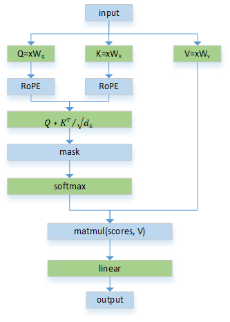
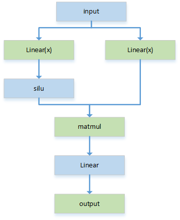
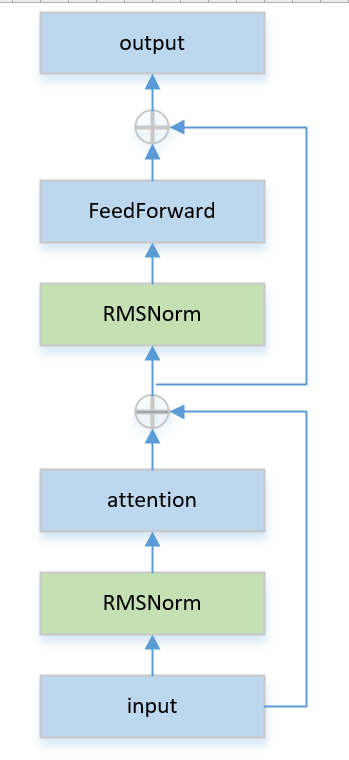
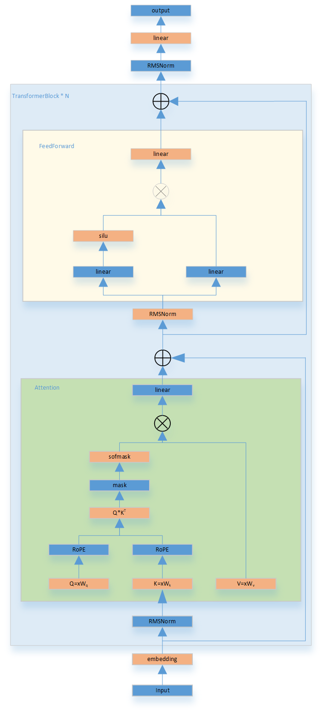

本文从[llama](https://github.com/meta-llama/llama)源码梳理其模型架构。从最小模块开始，逐步搭建整个transformer结构。
# 一、Attention
完整代码请参考官方代码仓库，这里只列出forward函数。
```python
    def forward(
        self,
        x: torch.Tensor,
        start_pos: int,
        freqs_cis: torch.Tensor,
        mask: Optional[torch.Tensor],
    ):
        """
        Forward pass of the attention module.

        Args:
            x (torch.Tensor): Input tensor.
            start_pos (int): Starting position for caching.
            freqs_cis (torch.Tensor): Precomputed frequency tensor.
            mask (torch.Tensor, optional): Attention mask tensor.

        Returns:
            torch.Tensor: Output tensor after attention.

        """
        bsz, seqlen, _ = x.shape
        xq, xk, xv = self.wq(x), self.wk(x), self.wv(x)

        xq = xq.view(bsz, seqlen, self.n_local_heads, self.head_dim)
        xk = xk.view(bsz, seqlen, self.n_local_kv_heads, self.head_dim)
        xv = xv.view(bsz, seqlen, self.n_local_kv_heads, self.head_dim)

        xq, xk = apply_rotary_emb(xq, xk, freqs_cis=freqs_cis)

        self.cache_k = self.cache_k.to(xq)
        self.cache_v = self.cache_v.to(xq)

        self.cache_k[:bsz, start_pos : start_pos + seqlen] = xk
        self.cache_v[:bsz, start_pos : start_pos + seqlen] = xv

        keys = self.cache_k[:bsz, : start_pos + seqlen]
        values = self.cache_v[:bsz, : start_pos + seqlen]

        # repeat k/v heads if n_kv_heads < n_heads
        keys = repeat_kv(keys, self.n_rep)  # (bs, cache_len + seqlen, n_local_heads, head_dim)
        values = repeat_kv(values, self.n_rep)  # (bs, cache_len + seqlen, n_local_heads, head_dim)

        xq = xq.transpose(1, 2)  # (bs, n_local_heads, seqlen, head_dim)
        keys = keys.transpose(1, 2) # (bs, n_local_heads, cache_len + seqlen, head_dim)
        values = values.transpose(1, 2) # (bs, n_local_heads, cache_len + seqlen, head_dim)
        scores = torch.matmul(xq, keys.transpose(2, 3)) / math.sqrt(self.head_dim)
        if mask is not None:
            scores = scores + mask  # (bs, n_local_heads, seqlen, cache_len + seqlen)
        scores = F.softmax(scores.float(), dim=-1).type_as(xq)
        output = torch.matmul(scores, values)  # (bs, n_local_heads, seqlen, head_dim)
        output = output.transpose(1, 2).contiguous().view(bsz, seqlen, -1)
        return self.wo(output)
```
根据forward绘制的流程图：



- 第一步计算Q、K、V:
$$Q=XW_q, K=XW_k, V=XW_v$$
- 第二步计算注意力得分: $QK^T/\sqrt{d^k}$ + mask
- 第三步归一化：softmask
- 第四步加权求和：$softmask() \times V$
- 最后：计算linear
# 二、FeedForward（FNN）
FNN模块包括三个全连接层，forward代码如下：
```python
def forward(self, x):
        return self.w2(F.silu(self.w1(x)) * self.w3(x))
```

# 三、TransformerBlock
TransformerBlock 的核心组件包括两个 RMSNorm 层、一个 Attention 模块和一个 FFN（前馈神经网络）模块，其计算流程如下：


# 四、Transformer
Transformer 类的主要组件包括 Embedding、若干层TransformerBlock、RMSNorm 和 Output 层



# 五、推理
推理过程的自回归在 `generation.py`的`generate()`函数中实现，下面是代码：
```python
 def generate(
        self,
        prompt_tokens: List[List[int]],
        max_gen_len: int,
        temperature: float = 0.6,
        top_p: float = 0.9,
        logprobs: bool = False,
        echo: bool = False,
    ) -> Tuple[List[List[int]], Optional[List[List[float]]]]:
        """
        Generate text sequences based on provided prompts using the language generation model.

        Args:
            prompt_tokens (List[List[int]]): List of tokenized prompts, where each prompt is represented as a list of integers.
            max_gen_len (int): Maximum length of the generated text sequence.
            temperature (float, optional): Temperature value for controlling randomness in sampling. Defaults to 0.6.
            top_p (float, optional): Top-p probability threshold for nucleus sampling. Defaults to 0.9.
            logprobs (bool, optional): Flag indicating whether to compute token log probabilities. Defaults to False.
            echo (bool, optional): Flag indicating whether to include prompt tokens in the generated output. Defaults to False.

        Returns:
            Tuple[List[List[int]], Optional[List[List[float]]]]: A tuple containing generated token sequences and, if logprobs is True, corresponding token log probabilities.

        Note:
            This method uses the provided prompts as a basis for generating text. It employs nucleus sampling to produce text with controlled randomness.
            If logprobs is True, token log probabilities are computed for each generated token.

        """
        params = self.model.params
        bsz = len(prompt_tokens)
        assert bsz <= params.max_batch_size, (bsz, params.max_batch_size)

        # promts 中最短和最长的promt的长度
        min_prompt_len = min(len(t) for t in prompt_tokens)
        max_prompt_len = max(len(t) for t in prompt_tokens)
        assert max_prompt_len <= params.max_seq_len 

        # 生成总长度(promt + 生成)
        total_len = min(params.max_seq_len, max_gen_len + max_prompt_len)

        pad_id = self.tokenizer.pad_id

        # token 增加 padding
        # [Can,     you,  tell,     me,   who,   you,   are,   ?,   pad, pad, ...]
        # [the, capital,    of,  china,   pad,   pad,   pad,   pad, pad, pad, ...]
        tokens = torch.full((bsz, total_len), pad_id, dtype=torch.long, device="cuda")
        for k, t in enumerate(prompt_tokens):
            tokens[k, : len(t)] = torch.tensor(t, dtype=torch.long, device="cuda")
        if logprobs:
            token_logprobs = torch.zeros_like(tokens, dtype=torch.float)

        prev_pos = 0
        eos_reached = torch.tensor([False] * bsz, device="cuda")
        input_text_mask = tokens != pad_id
        if min_prompt_len == total_len:
            logits = self.model.forward(tokens, prev_pos)
            token_logprobs = -F.cross_entropy(
                input=logits.transpose(1, 2),
                target=tokens,
                reduction="none",
                ignore_index=pad_id,
            ) 
        # 自回归过程
        for cur_pos in range(min_prompt_len, total_len):
            # 输入tokens（从prev_pos到cur_pos）
            # 
            logits = self.model.forward(tokens[:, prev_pos:cur_pos], prev_pos)
            if temperature > 0:
                probs = torch.softmax(logits[:, -1] / temperature, dim=-1)
                next_token = sample_top_p(probs, top_p)
            else:
                next_token = torch.argmax(logits[:, -1], dim=-1)

            next_token = next_token.reshape(-1)
            # 仅替换生成部分（保留原始prompt）
            next_token = torch.where(
                input_text_mask[:, cur_pos], tokens[:, cur_pos], next_token
            )
            tokens[:, cur_pos] = next_token
            if logprobs:
                token_logprobs[:, prev_pos + 1 : cur_pos + 1] = -F.cross_entropy(
                    input=logits.transpose(1, 2),
                    target=tokens[:, prev_pos + 1 : cur_pos + 1],
                    reduction="none",
                    ignore_index=pad_id,
                )
            eos_reached |= (~input_text_mask[:, cur_pos]) & (
                next_token == self.tokenizer.eos_id
            )
            prev_pos = cur_pos
            # 全部序列生成完成则退出
            if all(eos_reached):
                break

        if logprobs:
            token_logprobs = token_logprobs.tolist()
        out_tokens, out_logprobs = [], []
        for i, toks in enumerate(tokens.tolist()):
            # cut to max gen len
            start = 0 if echo else len(prompt_tokens[i])
            toks = toks[start : len(prompt_tokens[i]) + max_gen_len]
            probs = None
            if logprobs:
                probs = token_logprobs[i][start : len(prompt_tokens[i]) + max_gen_len]
            # cut to eos tok if any
            if self.tokenizer.eos_id in toks:
                eos_idx = toks.index(self.tokenizer.eos_id)
                toks = toks[:eos_idx]
                probs = probs[:eos_idx] if logprobs else None
            out_tokens.append(toks)
            out_logprobs.append(probs)
        return (out_tokens, out_logprobs if logprobs else None)
```

假设输入promts是：
```
["Can you tell me who you are?",
 "The capital of China is"]
```
假设tokenizer 之后，
```
[
    [1,  1815,   366,  2649,   592,   278, 398, 21432],
    [1, 15043, 29892,  1058,   526,   366]
]
```
然后， 给token增加padding
```
[
    [1,  1815,   366,  2649,   592,   278,   398, 21432,   pad,   pad,   pad,   pad, ...],
    [1, 15043, 29892,  1058,   526,   366,   pad,   pad,   pad,   pad,   pad,   pad, ...]
]
```
自回归过程：
```
for cur_pos in range(min_prompt_len, total_len):
    第一次进入循环，按上面的输入promt示例中，prev_pos = 0, cur_pos = 6
    1、取每个token 序列的[prev_pos,cur_pos]，就是取[0, 6], 给模型推理得到next_token
        第一个promt的输入为 [1,  1815,   366,  2649,   592,   278]
        第二个promt的输入为 [1, 15043, 29892,  1058,   526,   366]
    2、next_token = token[6] == "pad" ? next_token : token[6]。
        对于第一个promt，token[6]不为pad， 直接取原始输入对应位置的token, next_token = 398;
        对于第二个promt, token[6]为pad, 取模型的推理输出token，假设模型推理输出为 620，则next_token=620
    3、将 next_token 赋给 token[6]
        对于第一个promt, token序列为：[1,  1815,   366,  2649,   592,   278,   398, 21432,   pad,   pad,   pad,   pad, ...],
        对于第二个promt, token序列为：[1, 15043, 29892,  1058,   526,   366,   620,   pad,   pad,   pad,   pad,   pad, ...]
    4、prev_pos = cur_pos
    进入下次循环，prev_pos = 6, cur_pos = 7
    第一个promt的输入为 [398]
    第二个promt的输入为 [620]
    然后按上面2-4依次处理
    ...
```
总结来说，每个promt先将原始序列扔给算法推理，模型预测出一个token，然后在下一步中将刚才输出的token作为新的输入，进行下一次预测。

    


