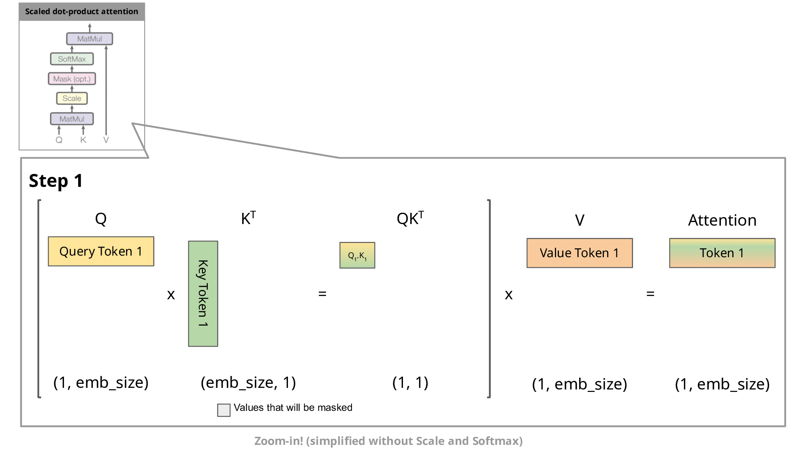

reference:
- [kv-caching-explained](https://medium.com/@joaolages/kv-caching-explained-276520203249)
- [The KV Cache: Memory Usage in Transformers](https://www.youtube.com/watch?v=80bIUggRJf4)

# 一、LLM的推理过程
在解码器的自回归生成过程中，给定输入后，模型预测出一个token，然后在下一步中将刚才输出的token作为新的输入，进行下一次预测。如图：

这种自回归行为会重复执行某些操作，我们放大 attention 中掩码缩放点积注意力计算，可以更好地理解这一点。

由于解码器是因果的（即，一个 token 的注意力仅取决于其前面的 token），在每一步生成过程中，我们都在重新计算相同的先前 token 注意力，而实际上我们只需要计算新输入 token 的注意力。

这就是 KV cache 的作用所在。通过缓存先前的 key 和 value，我们可以专注于仅计算新 token 的注意力。

之前在分析 llama 的推理代码时，可以看到llama的自回归过程是：在处理完成每个promt的原始序列后，模型预测出一个token，然后在下一步中将刚才输出的token作为新的输入，进行下一次预测。

# 二、kv cache的计算量分析
## 2.1 attention
$$Q=xW_Q, K = xW_k, V = xW_v \\
x_{out} = softmax(\frac{QK^T}{\sqrt{d_k}} + mask)\times V\times W_o + x
$$
我们只考虑单个输入，不考虑 batch_size。假设输入数据维度为[s, h]。
prefill 过程的计算量跟上一篇分析的一致。
decode 过程的计算量如下：

1、计算$Q_i、K_i、V_i$, 矩阵乘法的输入输出为：[1,h]x[h,h]->[1,h],计算量为$6h^2$。$K_i、V_i$跟缓存的$K_{cache},V_{cache}$拼接在一起形成新的K，V, 维度为[s,h]

2、$QK^T$, 矩阵乘法的输入输出为：[1,h]x[h,s] ->[1,s], 计算量为2sh

3、$scores \times V$, 矩阵乘法的输入输出为：[1,s]x[s,h]->[1,h], 计算量为2sh 

4、$ (...)\times W_o$, 矩阵乘法的输入输出为：[1,h]x[h,h]->[1,h], 计算量为$2h^2$

attention 部分总的计算量为：$4sh + 8h^2$
## 2.2 FeedForward
$$output = (f_{silu}(xW_1) * (xW_2)) \times W_3$$
其中，$W_1, W_3 \in R^{h \times 4h}, W_2 \in R^{4h \times h}$.

1、$xW_1$ 和 $xW_2$，矩阵乘法的输入输出是 [1,h] x [h,4h] -> [1, 4h]，计算量是$2\times 8h^2$

2、$f_{silu}(xW_1) * (xW_2)$ 点乘的输入输出是 [1,4h] * [1,4h]->[1,4h]，计算量是$4h$

3、$(...)\times W_3$, 矩阵乘法的输入输出是 [1,4h] x [4h,h]->[1,h]，计算量是$8h^2$

FeedForward 部分总的计算量为：$24h^2+4h$
## 2.3 logits proj
$$ output = xW_{vocab}$$
矩阵乘法的的输入输出是：[1,h]x[h,v] -> [1,v]，计算量是$2hv$.

故对于一个$l$层的模型，总的计算量为$l*(32h^2+4sh+4h)+2hv$

# 二、kv cache的显存占用分析
假设输入序列长度为$s$，输出序列的长度为$n$，以float16保存KV cache。
那么KV cache的峰值时，矩阵$K_{cache}，V_{cache}的维度是[s+n, h]$，那么显存占用为$b* 2*2*(s+n)*h*l$（$batch\_size*2bytes*2个矩阵*矩阵维度w*矩阵维度h*层数l$）