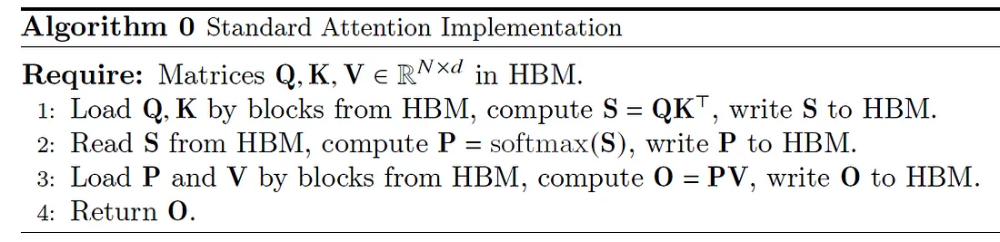
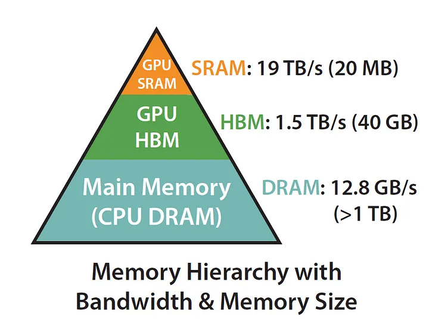
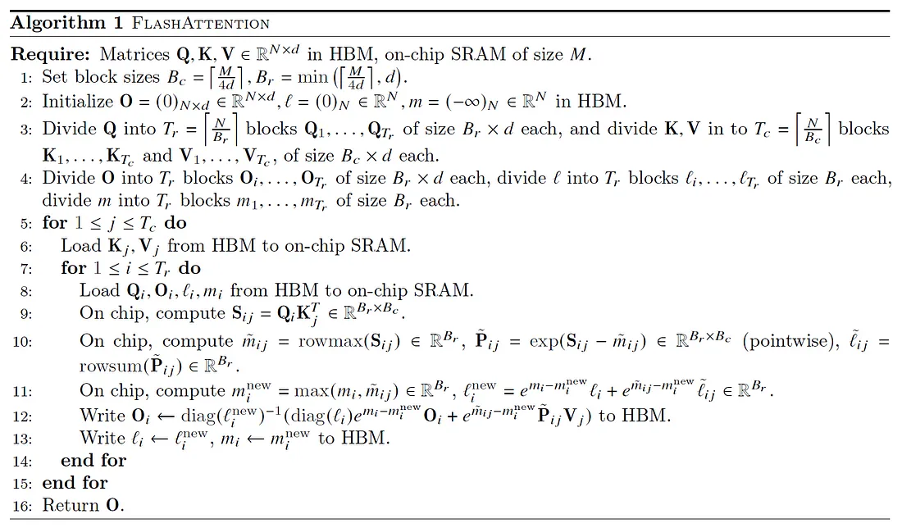

reference: 
- [paper](https://arxiv.org/pdf/2205.14135)
- [FlashAttention](https://gordicaleksa.medium.com/eli5-flash-attention-5c44017022ad)

# 一、标准注意力实现

标准注意力实现基本不考虑从HBM加载/存储的成本。但是我们知道，内存并非单一的整体，其本质上是分层的，普遍规律是：内存速度越快，价格越贵，容量越小。

# 二、分块下的softmax如何计算
对于向量$x \in R^B$
$$
x=[x_1,x_2,...,x_B] \\
m(x) := \max_i x_i = max(x_1,x_2,...,x_B) \\
f(x) := [e^{x_1-m(x)}, e^{x_2-m(x)}, ..., e^{x_B-m(x)}] \\
l(x) := \sum_{i}^{B}f(x)_i=e^{x_1-m(x)} + e^{x_2-m(x)} + ... + e^{x_B-m(x)} \\
softmax(x) := \frac{f(x)}{l(x)}=[\frac{e^{x_1-m(x)}}{l(x)}, \frac{e^{x_2-m(x)}}{l(x)}, ..., \frac{e^{x_B-m(x)}}{l(x)}]
$$
则对于向量$x^{(1)}, x^{(2)} \in R^B$, $x=[x^{(1)},x^{(2)}] \in R^{2B}$
$$
x^{(1)} = [x_1^{(1)},x_2^{(1)},...,x_B^{(1)}], x^{(2)}=[x_1^{(2)},x_2^{(2)},...,x_B^{(2)}]\\
m(x)=m([x^{(1)}, x^{(2)}])=max(m(x^{(1)}), m(x^{(2)})) \\
f(x)=[e^{m(x^{(1)}) - m(x)}f(x^{(1)}), e^{m(x^{(2)}) - m(x)}f(x^{(2)})]\\
l(x)=l([x^{(1)}, x^{(2)}])=e^{m(x^{(1)}) - m(x)}l(x^{(1)})+ e^{m(x^{(2)}) - m(x)}l(x^{(2)})\\
softmax(x)=\frac{f(x)}{l(x)}
$$
下面来推导$f(x),l(x)$
$$
f(x)=[e^{x_1^{(1)} - m(x)},e^{x_2^{(1)} - m(x)},...,e^{x_B^{(1)} - m(x)}, e^{x_1^{(2)} - m(x)},e^{x_2^{(2)} - m(x)},...,e^{x_B^{(2)} - m(x)}]\\
\to f(x)=[e^{x_1^{(1)} - m(x^{(1)}) +  m(x^{(1)}) - m(x)}, e^{x_2^{(1)} -m(x^{(1)}) +  m(x^{(1)}) - m(x)}, ...]\\
\to f(x)=[e^{x_1^{(1)} - m(x^{(1)})} * e^{m(x^{(1)}) - m(x)}, e^{x_2^{(1)} -m(x^{(1)})} * e^{m(x^{(1)}) - m(x)}, ...]\\
\to f(x)=[e^{m(x^{(1)}) - m(x)}f(x^{(1)}), e^{m(x^{(2)}) - m(x)}f(x^{(2)})]\\
l(x)=\sum_{i}^{B}e^{m(x^{(1)}) - m(x)}f(x^{(1)}) + \sum_{i}^{B}e^{m(x^{(2)}) - m(x)}f(x^{(2)})\\
\to l(x)=e^{m(x^{(1)}) - m(x)}l(x^{(1)})+ e^{m(x^{(2)}) - m(x)}l(x^{(2)})
$$
则$$softmax(x)=\frac{f(x)}{l(x)}=[\frac{e^{m(x^{(1)}) - m(x)}f(x^{(1)})}{e^{m(x^{(1)}) - m(x)}l(x^{(1)})+ e^{m(x^{(2)}) - m(x)}l(x^{(2)})}, \frac{e^{m(x^{(2)}) - m(x)}f(x^{(2)})}{e^{m(x^{(1)}) - m(x)}l(x^{(1)})+ e^{m(x^{(2)}) - m(x)}l(x^{(2)})}]$$

# 三、FlashAttention
FlashAttention的算法:

下面逐行解释算法：
- 0、假设矩阵$Q、K、V \in R^{N \times d}$位于HBM(GPU global memory)，on-chip SRAM(GPU share memory)的内存大小为 M。
- 1、设置块大小为 $B_c=\lceil \frac{M}{4d} \rceil，B_r=min(\lceil \frac{M}{4d} \rceil, d)$  
- 2、初始化 $[N \times d]$ 输出矩阵 O 全为0  
&nbsp;&nbsp;&nbsp;&nbsp;&nbsp;&nbsp;初始化 $N$ 维向量 $l$ 全为0。存储 softmax 的累积分母——指数分数的总和  
&nbsp;&nbsp;&nbsp;&nbsp;&nbsp;&nbsp;初始化 $N$ 维向量 $m$ 全为 $-\infty$。存储按行最大分数
- 3、使用步骤1中的块大小将 Q、K、V 分块。  
&nbsp;&nbsp;&nbsp;&nbsp;&nbsp;&nbsp;Q 按 $B_r$ 分块 $Q_1,...,Q_{T_r}$，每个块的维度是 $[B_r \times d]$, Q的块数为$T_r=\lceil \frac{N}{B_r} \rceil$。  
&nbsp;&nbsp;&nbsp;&nbsp;&nbsp;&nbsp;K、V 按 $B_c$ 分块为 $K_1,...,K_{T_c}$ 和 $V_1,...,V_{T_c}$，每个块的维度是 $[B_c \times d]$，K、V 的块数为$T_c=\lceil \frac{N}{B_c} \rceil$。
- 4、将O、l、m 按 $B_r$ 分块。  
&nbsp;&nbsp;&nbsp;&nbsp;&nbsp;&nbsp;O(矩阵) 分成 $O_1,...,O_{T_r}$，每个块大小为 $[B_r \times d]$；  
&nbsp;&nbsp;&nbsp;&nbsp;&nbsp;&nbsp;l(向量) 分成 $l_1,...,l_{T_r}$，每个块大小为 $B_r$  
&nbsp;&nbsp;&nbsp;&nbsp;&nbsp;&nbsp;m(向量) 分成 $m_1,...,m_{T_r}$，每个块大小为 $B_r$
- 5、outloop 遍历 $for \  \ 1 \le j \le T_c $，即遍历 Key/Value 向量
- 6、从 HBM(global memory) 加载 $K_i,V_i$ 到 on-chip SRAM(share memory).由于我们构建块大小的方式，此时 SRAM 仍有至少 50%未被占用（用于 Q 和 O）。
- 7、innerloop 遍历 $for \  \ 1 \le i \le T_r $，即对 Query 向量进行循环
- 8、从 HBM 加载 $Q_i,O_i,l_i,m_i$ 到 on-chip SRAM。
- 9、计算 $S_{ij}=Q_iK_j^T \in R^{B_r \times B_c}$
- 10、使用上一步的 $S_{ij}$ 计算 $m_{ij},l_{ij},P_{ij}$
$$m_{ij}=rowmax(S_{ij}) \in R^{B_r} \\
P_{ij}=exp(S_{ij} - m_{ij}) \in R^{B_r \times B_c}\\
l_{ij}=rowsum(p_{ij}) \in R^{B_r}
$$
- 11、计算 $$m_i^{new}=max(m_i, m_{ij}) \\ l_i^{new}=e^{m_i-m_i^{new}}l_i + e^{m_{ij-m_i^{new}}}l_{ij}$$
- 12、 
$$ Write \ O_i \gets diag(l_i^{new})^{-1}(diag(l_i)e^{m_i-m_i^{new}}O_i + e^{m_{ij}-m_i^{new}}P_{ij}V_j)
$$
这里是最难理解的一步，我们来推导一下：  
只第一个块时，第一个块的softmax输出:
$$O_i\gets （softmax(x^{(1)})= \frac{f(x^{(1)})}{l(x^{(1)})}）V_j \\
从而O_i=[\frac{f(x^{(1)})}{l(x^{(1)})}V_j, 0, 0, 0,...] \\
(请记住这里 O_i 是向量，且其余块的值都为0)
$$
第一、二个块时，第一个块的softmax输出:
$$
softmax(x^{(1)})=\frac{e^{m(x^{(1)}) - m(x)}f(x^{(1)})}{e^{m(x^{(1)}) - m(x)}l(x^{(1)})+ e^{m(x^{(2)}) - m(x)}l(x^{(2)})}\\
\to
softmax(x^{(1)})=\frac{e^{m(x^{(1)}) - m(x)}O_il(x^{(1)})}{e^{m(x^{(1)}) - m(x)}l(x^{(1)})+ e^{m(x^{(2)}) - m(x)}l(x^{(2)})}\frac{1}{V_j} \\
\to softmax(x^{(1)})=\frac{e^{m(x^{(1)}) - m(x)}O_il(_i)}{l_i^{new}}\frac{1}{V_j}
$$
第二个块的softmax输出：
$$
softmax(x^{(2)})=\frac{e^{m(x^{(2)}) - m(x)}f(x^{(2)})}{e^{m(x^{(1)}) - m(x)}l(x^{(1)})+ e^{m(x^{(2)}) - m(x)}l(x^{(2)})}\\
\to softmax(x^{(2)})=\frac{e^{m(x^{(2)}) - m(x)}f(x^{(2)})}{l_i^{new}}$$

这就是每个块softmax结果的递推过程了。我们接下来拆解一下步骤12中的公式：  
1、$diag(l_i^{new})^{-1}$ 即将 $l_i^{new}$ 作为分母  
2、$diag(l_i)e^{m_i-m_i^{new}}O_i$ 不难发现是我们上面推导的 $softmax(x^{(1)})=\frac{e^{m(x^{(1)}) - m(x)}O_il(_i)}{l_i^{new}}$ 的分子部分  
3、而$e^{m_{ij}-m_i^{new}}P_{ij}$ 就是上面 $softmax(x^{(2)})=\frac{e^{m(x^{(2)}) - m(x)}f(x^{(2)})}{l_i^{new}}$ 的分子部分

- 13、
$$Write \ l_i \gets l_i^{new}, m_i \gets m_i^{new} \ \ to \  \ \ HBM
$$
- 14、 end for innerloop
- 15、end for outloop
- 16、Return O

过一遍算法我产生了以下几个疑问：
- 1、为什么$B_c=\lceil \frac{M}{4d} \rceil，B_r=min(\lceil \frac{M}{4d} \rceil, d)$ 采用不同的取值方式
论文作者的回答：我们不希望 $B_r$ 大于 d，因为我们希望 $B_c * B_r <= M / 4$（我们在 SRAM 上存储几个大小为 $B_c * B_r$ 的矩阵）
    
- 2、为什么是$\lceil \frac{M}{4d} \rceil$  
因为SRAM需要存放$Q_i、K_i、V_i、O_i$，其向量都是d维的，而且最大化利用SRAM，故为 $\lceil \frac{M}{4d} \rceil$ 

# 三、IO复杂度分析
这里不使用时间复杂度分析，而是另一个指标：HBM访问次数。
## 3.1 标准注意力复杂度分析
标准注意力也是分块加载和计算，但是没有其他优化手段，所以可以认为是加载完整矩阵进行计算
- 1、加载 $Q、K \in R^{N \times d}$, 计算 $S\in R^{N \times N}$， 并写回 $S$，有 $2Nd + N^2$ 次HBM访问
- 2、加载 $S$, 计算 $P\in R^{N \times N}$，写回 $P$, 有 $2N^2$ 次HBM访问
- 3、加载 $P、V$，计算 $O \in R^{N \times d}$, 写回 $O$，有 $2Nd+N^2$ 次HBM访问  

总共有 $4Nd+ 4N^2$次HBM访问，去掉常数项，有 $O(Nd+N^2)$
## 3.2 FlashAttention的复杂度分析
我们可以从上面第5步开始
- 1、加载 $K_i,V_i$, 总共 $T_c$ 次，故有 $T_c \times (B_c \times d \times 2)$ 次HBM访问
- 2、针对每次加载的 $K_i,V_i$，总共加载 $T_r$ 次 $Q_i、O_i、l_i+m_i$，故有 $T_c \times T_r \times (B_r \times d \times 2 + B_r \times 2)$ 次HBM访问

相加，总共有 
$$ T_c \times (B_c \times d \times 2) + T_c \times T_r \times (B_r \times d \times 2 + B_r \times 2) \\
= \frac{N}{B_c}\times (B_c \times d \times 2) + \frac{N}{B_c} \times \frac{N}{B_r}\times (B_r \times d \times 2 + B_r \times 2) \\
= 2Nd + \frac{N^2}{B_c} \times (2d+2) \\
= 2Nd + \frac{8N^2d^2}{M} + \frac{8N^2d}{M}
$$
论文中设定$N$为序列长度，$d$ 为头维度，$M$ 为具有 $d <= M <= Nd$ 的SRAM 大小，故我们去掉上面计算结果的常数项和低次项，则FlashAttention 需要$O(\frac{N^2d^2}{M})$ 次HBM访问

对于典型的 $d$ (64-128) 和 $M$ (约100KB)，$d^2$ 比 $M$ 小很多，则 $\frac{d^2}{M}N^2$ 比 $Nd+N^2$ 小很多。

# 四、块稀疏FlashAttention
对于给定的$Q、K、V \in R^{N \times N}$,掩码矩阵 $\tilde M \in \{0,1\}^{N\times N }$，计算
$$
S=QK^T \in R^{N \times N}, P=softmax(S \odot 1_{\tilde M}) \in R^{N \times N}, O=PV \in R^{N \times d} \\
其中 \begin{cases}
(S \odot 1_{\tilde M})_{kl}= S_{kl}   &\text{if} \enspace  \tilde M_{kl} = 1 \\
(S \odot 1_{\tilde M})_{kl}=- \infin  &\text{if} \enspace   M_{kl} = 0

\end{cases}
$$

