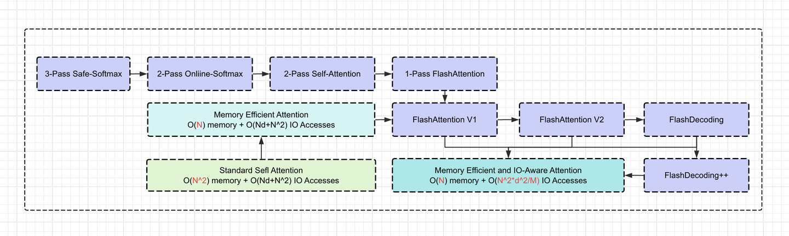

attention的优化发展历程：



# 一、 标准 Self-Attention
忽略 mask 和 scale
$$
O=softmax(QK^T)V \tag{1}
$$
标准注意力的计算过程可分为一些几个阶段:
$$S=QK^T \tag{2}$$ 
$$P=softmax(S) \tag{3}$$
$$O=PV \tag{4}$$
步骤一和步骤二会分别产生两个中间矩阵$S、P\in R^{N \times N}$, 内存需求是$O(N^2)$，HBM IO 复杂度是$O(Nd+N^2)$。

# 二、safe softmax（3-pass）
对于向量$x=\{x_1,x_2,...,x_N\}$，softmax的通用计算公式是：
$$sum =\sum_{j=1}^Ne^{x_j}  \tag{5}$$ 
$$softmax([x_1,x_2,...,x_N])=\{\frac{e^{x_i}}{sum}\}_{i=1}^N = \{\frac{e^{x_1}}{sum},\frac{e^{x_2}}{sum},...,\frac{e^{x_N}}{sum}\} \tag{6}$$

由于$x^i$可能会非常大，则 $e^{x_i}$ 很容易溢出。比如，float16 的最大值是 65536，当$x_i>11$时，$e^{x_i}$ 就超出 float16 的范围了。  
为了解决溢出的问题，有了safe-softmax：
$$m=\max_i x_i = max(x_1,x_2,...,x_N) \tag{7}$$ 
$$sum =\sum_{j=1}^Ne^{x_j-m} \tag{8}$$
$$safe\_softmax([x_1,x_2,...,x_N])=\{\frac{e^{x_i-m}}{sum}\}_{i=1}^N = \{\frac{e^{x_1-m}}{sum},\frac{e^{x_2-m}}{sum},...,\frac{e^{x_N-m}}{sum}\} \tag{9}
$$
由于 $x_i - m <= 0$，因此可以确保$e^{x_i-m}$不会溢出。

## Algorithm 3-pass safe softmax 
safe-softmax可以总结为以下 3 阶段算法。  

参数说明：  
$\{m_i\}: max_{j=1}^i{x_j}$，初始化 $m_0 = -\infty $。  
$\{d_i\}:\sum_{j=1}^ie^{x_j-m_N}$, $d_N$ 为softmax的分母，初始化 $d_0=0$。  
$\{a_i\}$: 最终的softmax 值  

算法：  
**for** $i \gets 1,N$ **do**
$$
m_i \gets max(m_{i-1},x_i) \tag{10}$$
**end**

**for** $i \gets 1,N$ **do**
$$
d_i \gets d_{i-1} + e^{x_i-m_N} \tag{11}
$$
**end**

**for** $i \gets 1,N$ **do**
$$
a_i\gets \frac{e^{x_i-m_N}}{d_N}\tag{12}
$$
**end**


这个算法要求我们做 3 次for循环，在Transformer的自注意力机制中，$x_i$是由 $QK^T$计算得到的logits。这意味着，如果我们没有足够大的 SRAM 存储所有的 logits，那么我们就需要访问 $Q$ 和 $K$ 三次(为了重新计算logits), 显然这个是非常低效的。
# 三、Online Softmax（2-pass）
如果能够将方程10、11和12融合到一个循环中，那么我们可以将 global memory 访问次数从3减至1。但是，由于方程11依赖 $m_N$，而 $m_N$ 在第一个循环结束时才能确定，所以我们无法将方程10、11融合到一起。  
那能否推导出一个不依赖$m_N$的公式呢？  
我们构造 $d_i^{'} = \sum_{j=1}^i e^{x_j-m_i}$，当 $i=N$时，有$d_i^{'} = d_N$。我们来推导 $d_i^{'}$ 和  $d_{i-1}^{'}$ 之间的递推关系：
$$d_i^{'} = \sum_{j=1}^i e^{x_j-m_i} \\
\quad\quad\quad\quad\quad\:\:= \sum_{j=1}^{i-1}e^{x_j-m_{i-1}} + e^{x_i-m_i}\\
\quad\quad\quad\quad\quad\quad\quad\quad\:\:\:\:= \sum_{j=1}^{i-1}e^{x_j-m_{i-1}+m_{i-1}-m_i} + e^{x_i-m_i} \\
\quad\quad\quad\quad\quad\quad\quad\quad\:\:\:\:= \sum_{j=1}^{i-1}e^{x_j-m_{i-1}}e^{m_{i-1}-m_i}+e^{x_i-m_i} \\ 
\quad\quad\quad\quad\quad\:\:\:\:= d_{i-1}^{'}e^{m_{i-1}-m_i}+e^{x_i-m_i} \tag{13}$$
这个递归形式只依赖于 $m_i$ 和 $m_{i-1}$，从而我们可以在同一个循环中计算 $m_i$ 和 $d_i^{'}$，当 $i=N$ 时，我们得到了$d_N^{'}$， 也就得到了 $d_N$。
## Algorithm 2-pass online softmax 
我们得到了 2-pass的online softmax算法：

**for** $i \gets 1,N$ **do**
$$
m_i \gets max(m_{i-1},x_i)\\
d_i^{'} \gets d_{i-1}^{'}e^{m_{i-1}-m_i}+e^{x_i-m_i} \tag{14}
$$
**end**

**for** $i \gets 1,N$ **do**
$$
a_i\gets \frac{e^{x_i-m_N}}{d_N^{'}} \tag{15}
$$
**end**


那么2-pass算法对比3-pass算法有什么优势呢？好像FLOPs计算量并没有减少，甚至还略有增加，因为现在每次都需要计算额外的scale，也就是 $d_{i-1}^{'}e^{m_{i-1}-m_i}$.首先，我们要谨记一个基础假设：
```
x值，也就是pre-softmax logits，由于需要O(N^2)的显存无法放在SRAM中。因此：
1. 要么提前计算好x，保存在全局显存中，需要O(N^2)的显存，容易爆显存。
2. 要么在算法中online计算，每次循环中去load一部分Q，K到片上内存，计算得到x。
```
Attention优化的目标就是避开第一种情况，尽可能节省显存，否则，LLM根本无法处理类似100K以上这种long context的情况。而对于第二种情况，我们不需要保存中间矩阵x，节省了显存，但是计算没有节省，并且增加了HBM IO Accesses（需要不断地load Q, K）。此时，2-pass算法相对于3-pass算法，可以减少一次整体的load Q, K以及减少一次对 $x_i$ 的online recompute，因为在2-pass的第一个pass中，$x_i$ 是被两次计算共享的。
# 四、FlashAttention v1
Online Softmax仍需要2次遍历来完成softmax计算，那么我们能否将遍历次数减少到1呢？遗憾的是，对于softmax而言，并不存在这样的1-pass算法。但是！Attention的目标，并不是求softmax，而是求最终的O：
$$
O=softmax(QK^T)V 
$$
那么能否为 O 找到一个单次遍历的递归形式？  
我们尝试将 Self-Attention 计算的 k 行（所有行的计算是独立的，我们为简单起见解释其中一行的计算）表述为递归算法：
## Algorithm multi-pass Self-Attention
参数说明：  
$Q[k,:]$ ： $Q$ 矩阵的第 k 行向量。  
$K^T[:,i]$ ：$K^T$ 矩阵的第 i 列向量。  
$O[k,:]$ ：输出矩阵 $O$ 的第 k 行。  
$V[i,:]$ ： $V$ 矩阵的第 i 行。  
$\{o_i\}：\sum_{j=1}^ia_jV[j,:]$ ：存储 $A[k,:i]\times V[:i,:]$结果的行向量。
算法：  
**for** $i \gets 1,N$ **do**
$$
x_i \gets Q[k,:]K^T[:,i] \\
m_i \gets max(m_{i-1},x_i) \\
d_i^{'} \gets d_{i-1}^{'}e^{m_{i-1}-m_i}+e^{x_i-m_i} \tag{16}
$$
**end**

**for** $i \gets 1,N$ **do**
$$
a_i \gets \frac{e^{x_i-m_N}}{d_N^{'}} \tag{17}$$
$$
o_i \gets o_{i-1} + a_iV[i,:] \tag{18}
$$
**end**
$$
O[k,:]\gets o_N \tag{19}
$$
将公式17代入公式18,得:
$$o_i=\sum_{j=1}^i\frac{e^{x_j-m_N}}{d_N^{'}}V[j,:] \tag{19}$$
$o_i$还是和 $m_N、d_N$ 相关，而这两个值在第一个循环之后才能确定。我们尝试使用Online Softmax 中的方式去推导出一个不依赖 $m_N、d_N$ 的公式:  
有：
$$
o_{i}^{'}=\sum_{j=1}^i\frac{e^{x_j-m_i}}{d_i^{'}}V[j,:] \\
\quad\quad\quad\quad\quad\quad\quad\:\:=\sum_{j=1}^{i-1}\frac{e^{x_j-m_i}}{d_i^{'}}V[j,:] + \frac{e^{x_i-m_i}}{d_i^{'}}V[i,:] \\
\quad\quad\quad\quad\quad\quad\quad\quad\quad\quad\quad\:\:=\sum_{j=1}^{i-1}\frac{e^{x_j-m_{i-1} + m_{i-1} - m_i}}{d_i^{'}}V[j,:] + \frac{e^{x_i-m_i}}{d_i^{'}}V[i,:] \\
\quad\quad\quad\quad\quad\quad\quad\quad\quad\quad\quad\quad\:=\sum_{j=1}^{i-1}\frac{e^{x_j-m_{i-1}}}{d_i^{'}}(e^{m_{i-1} - m_i})V[j,:] + \frac{e^{x_i-m_i}}{d_i^{'}}V[i,:]\\
\quad\quad\quad\quad\quad\quad\quad\quad\quad\quad\quad\quad\:\:\:=\sum_{j=1}^{i-1}\frac{e^{x_j-m_{i-1}}}{d_i^{'}} \frac{d_i^{'}}{d_{i-1}^{'}} \frac{d_{i-1}^{'}}{d_{i}^{'}}  (e^{m_{i-1} - m_i})V[j,:] + \frac{e^{x_i-m_i}}{d_i^{'}}V[i,:]\\
\quad\quad\quad\quad\quad\quad\quad\quad\quad\quad\quad\quad\:\:\:= (\sum_{j=1}^{i-1}\frac{e^{x_j-m_{i-1}}}{d_{i-1}^{'}}V[j,:] )\frac{d_{i-1}^{'}}{d_{i}^{'}}  (e^{m_{i-1} - m_i})  + \frac{e^{x_i-m_i}}{d_i^{'}}V[i,:] \\
\quad\quad\quad\quad\quad\quad\quad\:\:\:= o_{i-1}^{'}\frac{d_{i-1}^{'}}{d_{i}^{'}}  (e^{m_{i-1} - m_i}) + \frac{e^{x_i-m_i}}{d_i^{'}}V[i,:]
$$
这个递推关系取决于$d_i^{'}、d_{i-1}^{'}、m_i、m_{i-1}$ 和 $x_i$，因而我们可以将Self-Attention的计算融合到一次循环中。

## Algorithm FlashAttention（1-pass ）
我们把第二个循环的计算，完全合并到第一个循环中去。从而得到1-pass FlashAttention的算法：  
**for** $i \gets 1,N$ **do**
$$
x_i \gets Q[k,:]K^T[:,i] \\
m_i \gets max(m_{i-1},x_i) \\
d_i^{'} \gets d_{i-1}^{'}e^{m_{i-1}-m_i}+e^{x_i-m_i} \\
o_{i}^{'} \gets o_{i-1}^{'}\frac{d_{i-1}^{'}e^{m_{i-1} - m_i}}{d_{i}^{'}} + \frac{e^{x_i-m_i}}{d_i^{'}}V[i,:]
$$
**end**
$$
O[k,:]\gets o_N^{'}
$$

进一步，如果我们对矩阵Q, K进行Tiling，就可以得到分块Tiling版本的FlashAttention。

## Algorithm Tiling FlashAttention
参数说明：  
b: 块大小  
T: 块的个数，$T=\frac{N}{b}$  
$x_i$：存储第i个块的$Q[k]K^T$结果，即$[(i-1)b:ib]$  
$m_i$: $x_i$的最大值  

算法：
**for** $i \gets 1,T$ **do**
$$
x_i \gets Q[k,:]K^T[:,(i-1)b:ib] \\
$$
**end**
# 五、FlashAttention v2
# 六、FlashAttention v3
To be Continue ...