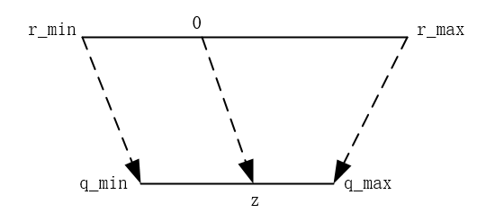
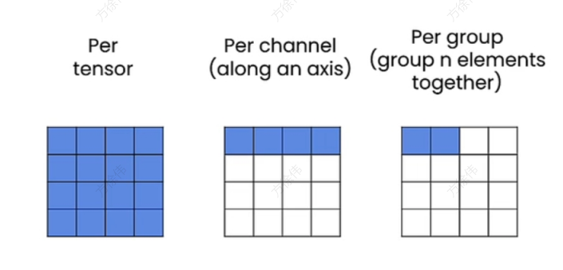

# 量化
## 一、什么是量化
量化是将模型中的高精度(如float32)权重和激活值转换为低精度数值(如int8)表示
### 1.1 量化的分类
根据映射函数是否是线性可以分为两类：线性量化和非线性量化，这里主要研究线性量化技术。

根据量化的粒度可分为：per tensor、per channel、per group

根据量化的时机可分为：训练后量化 PTQ(Post-Training Quantization)、训练时量化 QAT(Quantization-Aware Training)
### 1.2 量化的优势
1、更小的模型，更少的内存
2、更快的速度
### 1.3 量化的挑战
1、Quantization error
2、Retraining(QAT)
3、Limited Hardware support
4、Calibration dataset needed
5、packing/unpacking
### 1.4 如何评估量化的好坏
一般将量化后的数据再反量化回去，然后计算出原始数据和反量化数据的均方差，即
$$quant\_err=(input\_tensor-dequant\_tensor).square().mean()$$
## 二、线性量化
### 2.1 映射
考虑一个普遍性的问题，如图，需要将$R∈[r\_min,r\_max]$映射到$Q∈[q\_min,q\_max]$, 且 R 中的0映射到 Q 中的 z。

现在在 R 中任取一点 r ,假设 r 映射到 Q 中的点为 q ,那么有如下的关系式：
$$\frac{r-0}{q-z} = s$$
从而我们得到量化关系式为：
$$q=\frac{r}{s}+z\\
q=round(q)\\
q=clamp(q)$$
反量化关系式为：
$$r=s(q-z)$$
当z为0时，这种特殊的量化方式为对称量化；当z不为0时，为非对称量化。在量化中，我们习惯称s为scale，z为zero_point.

### 2.2 非对称量化的简单实现
simple_quant_01.py：
```python
import torch

def dequant(tensor,scale,zero_point):
    #注意这里的tensor进行了强制类型转换，否则容易出现溢出的风险
    r_tensor = (tensor.float() - zero_point) * scale

def linear_quant_with_zero_point(tensor,scale,zero_point,dtype=torch.int8)：
    scaled_tensor = tensor / scale + zero_point
    round_tensor = torch.round(scaled_tensor)
    q_min = torch.iinfo(dtype).min
    q_max = torch.iinfo(dtype).max
    q_tensor = round_tensor.clamp(q_min,q_max).to(dtype)
    return q_tensor

r = torch.tensor([
    [191.6,-13.5,728.6],
    [92.14,295.5,-184],
    [0,684.6,245.5]
    ])
scale = 3.5
zero_point = -70
#量化
q = linear_quant_with_zero_point(r,scale,zero_point)
print(f"quantized tensor:{q}")
#反量化
r_dequant = linear_dequant(q,scale,zero_point)
print(f"dequantized tensor:{r_dequant}")
#量化误差
quant_error = r - r_dequant
print(f"quant_error tensor:{quant_error}")
print(f"quant_error:{quant_error.square().mean()}")

```
输出为：
```
quantized tensor:tensor([[ -15,  -74,  127],
        [ -44,   14, -123],
        [ -70,  126,    0]], dtype=torch.int8)
dequantized tensor:tensor([[ 192.5000,  -14.0000,  689.5000],
        [  91.0000,  294.0000, -185.5000],
        [   0.0000,  686.0000,  245.0000]])
quant_error tensor:tensor([[-0.9000,  0.5000, 39.1000],
        [ 1.1400,  1.5000,  1.5000],
        [ 0.0000, -1.4000,  0.5000]])
quant_error:170.87530517578125
```
量化误差还是很大的，这是因为这里的scale和zero_point是随机设定的，接下来介绍如何找出最优的scale和zero_point
### 2.3 scale和zero_point
线性量化将$R∈[r\_min,r\_max]$映射到$Q∈[q\_min,q\_max]$，从极值考虑，有：
$$r_{min} = s(q_{min} - z)\\
r_{max} = s(q_{max} - z)$$
从而得到：$$s = \frac{r_{max}-r_{min}}{q_{max} - q_{ming}}\\
z=int(round(q_{min} - \frac{r_{min}}{s}))$$
特别地，当$z<=q_{min}$,则$z=q_{min}$;当$z>=q_{max}$,则$z=q_{max}$。
我们用新的scale和zero_point量化上文simple_quant_01.py：
$$r_{max} = 728.6, r_{min} = -184\\
q_{max} = 127, q_{min}=-128\\
\to s = \frac{728.6 - (-184)}{127 - (-128)} = 3.58\\
\to z=int(round(-128 - \frac{-184}{3.58})) = -77$$
我们编写 simple_quant_02_asymmetric.py
```python
import torch

def linear_dequant(tensor,scale,zero_point):
    #注意这里的tensor进行了强制类型转换，否则容易出现溢出的风险
    r_tensor = (tensor.float() - zero_point) * scale
    return r_tensor

def linear_quant_with_zero_point(tensor,scale,zero_point,dtype=torch.int8):
    scaled_tensor = tensor / scale + zero_point
    round_tensor = torch.round(scaled_tensor)
    q_min = torch.iinfo(dtype).min
    q_max = torch.iinfo(dtype).max
    q_tensor = round_tensor.clamp(q_min,q_max).to(dtype)
    return q_tensor

def get_scale_and_zero_point(tensor,dtype=torch.int8):
    q_max = torch.iinfo(dtype).max
    q_min = torch.iinfo(dtype).min
    r_max = tensor.max().item()
    r_min = tensor.min().item()
    scale = (r_max - r_min)/(q_max - q_min)
    zero_point = q_min - (r_min / scale)
    if zero_point < q_min:
        zero_point = q_min
    elif zero_point > q_max:
        zero_point = q_max
    else:
        zero_point =int(round(zero_point))
    return scale,zero_point

r = torch.tensor([
    [191.6,-13.5,728.6],
    [92.14,295.5,-184],
    [0,684.6,245.5]
    ])

s,z=get_scale_and_zero_point(r, torch.int8)
print(f"scale:{s} zero_point:{z}")
q = linear_quant_with_zero_point(r, s, z)
print(f"quantized tensor:{q}")

r_dequant = linear_dequant(q, s, z)
print(f"dequantized tensor:{r_dequant}")

quant_error = r - r_dequant
print(f"quant_error tensor:{quant_error}")
print(f"quant_error:{quant_error.square().mean()}")
```
运行得：
```
scale:3.578823433670343 zero_point:-77
quantized tensor:tensor([[ -23,  -81,  127],
        [ -51,    6, -128],
        [ -77,  114,   -8]], dtype=torch.int8)
dequantized tensor:tensor([[ 193.2565,  -14.3153,  730.0800],
        [  93.0494,  297.0423, -182.5200],
        [   0.0000,  683.5552,  246.9388]])
quant_error tensor:tensor([[-1.6564,  0.8153, -1.4800],
        [-0.9094, -1.5423, -1.4800],
        [ 0.0000,  1.0447, -1.4388]])
quant_error:1.5729731321334839
```
这样的量化误差已经很小了
### 2.4 对称量化
当zero_point为0时为对称量化，那么有：
$$s=\frac{r_{max}}{q_{max}}\\
q = clamp(round(\frac{r}{s}))$$
我们来实现对称量化,simple_quant_03_symmetric.py
```python
import torch

def linear_dequant(tensor,scale,zero_point):
    #注意这里的tensor进行了强制类型转换，否则容易出现溢出的风险
    r_tensor = (tensor.float() - zero_point) * scale
    return r_tensor

def linear_quant_with_zero_point(tensor,scale,zero_point,dtype=torch.int8):
    scaled_tensor = tensor / scale + zero_point
    round_tensor = torch.round(scaled_tensor)
    q_min = torch.iinfo(dtype).min
    q_max = torch.iinfo(dtype).max
    q_tensor = round_tensor.clamp(q_min,q_max).to(dtype)
    return q_tensor

def get_scale_symmetric(tensor,dtype=torch.int8):
    q_max = torch.iinfo(dtype).max
    r_max = tensor.max().item()
    scale = r_max/q_max
    return scale

r = torch.tensor([
    [191.6,-13.5,728.6],
    [92.14,295.5,-184],
    [0,684.6,245.5]
    ])

s=get_scale_symmetric(r, torch.int8)
print(f"scale:{s}")
q = linear_quant_with_zero_point(r, s, zero_point=0)
print(f"quantized tensor:{q}")

r_dequant = linear_dequant(q, s, zero_point=0)
print(f"dequantized tensor:{r_dequant}")

quant_error = r - r_dequant
print(f"quant_error tensor:{quant_error}")
print(f"quant_error:{quant_error.square().mean()}")
```
运行得:
```
scale:5.737007681779035
quantized tensor:tensor([[ 33,  -2, 127],
        [ 16,  52, -32],
        [  0, 119,  43]], dtype=torch.int8)
dequantized tensor:tensor([[ 189.3213,  -11.4740,  728.6000],
        [  91.7921,  298.3244, -183.5842],
        [   0.0000,  682.7039,  246.6913]])
quant_error tensor:tensor([[ 2.2787, -2.0260,  0.0000],
        [ 0.3479, -2.8244, -0.4158],
        [ 0.0000,  1.8961, -1.1913]])
quant_error:2.5091912746429443
```
## 三、量化粒度
根据量化粒度划分为：逐层量化(per tensor)、逐通道量化(per channel)、逐组量化(per group)

### 3.1 per tensor
前面第二节其实都是逐层量化，整个tensor使用相同的scale和zero_point。我们用对称量化简单实现一下逐层量化，这里调用了第二节定义的函数。
```python
def linear_quant_per_tensor(tensor,scale, dtype=torch.int8):
    scale = get_scale_symmetric(tensor, dtype)
    q = linear_quant_with_zero_point(input_tensor, scale, zero_point=0)
    return q

input_tensor = torch.tensor(
    [[191.6,-13.5,728.6],
     [92.14,295.5,-184],
     [0,684.6,245.5]]
    )

quantized_tensor = linear_quant_per_tensor(input_tensor)

```
### 3.2 per channel
同样用对称量化实现逐通道量化，以二维tensor为例，这里：
dim = 0, 沿行量化
dim = 1, 沿列量化
```python
def linear_quant_per_channel(tensor, dim, dtype=torch.int8):
    output_dim = tensor.shape[dim] # 沿dim的维度大小
    scale = torch.zeros(output_dim) # 创建一个对应维度的tensor，用于存储scale
    for i in range(output_dim):
        sub_tensor = tensor.select(dim, i)
        scale[i] = get_scale_symmetric(sub_tensor, dtype=dtype)
    
    scale_shape = [1] * tensor.dim()
    scale_shape[dim] = -1
    scale = scale.view(scale_shape)
    quantized_tensor = linear_quant_with_zero_point(tensor, scale=scale, zero_point=0, dtype=dtype)
    return quantized_tensor, scale
```
运行 simple_quant_04_per_channel.py
```
quantized tensor:tensor([[ 33,  -2, 127],
        [ 40, 127, -79],
        [  0, 127,  46]], dtype=torch.int8)
dequantized tensor:tensor([[ 189.3213,  -11.4740,  728.6000],
        [  93.0709,  295.5000, -183.8150],
        [   0.0000,  684.6000,  247.9653]])
quant_error tensor:tensor([[ 2.2787, -2.0260,  0.0000],
        [-0.9309,  0.0000, -0.1850],
        [ 0.0000,  0.0000, -2.4653]])
quant_error:1.8084441423416138
```
### 3.3 per group
per group的实现是先将tensor按group_size reshape，得到每行为group_size大小的新tensor，然后调用per channel 量化，最后reshape回去
```python
def linear_quant_per_group(tensor, group_size, dtype=torch.int8):
    t_shape = tensor.shape
    assert t_shape[1] % group_size == 0
    assert tensor.dim() == 2

    tensor = tensor.view(-1, group_size)
    quantized_tensor, scale = linear_quant_per_channel(tensor, dim=0, dtype=dtype)
    quantized_tensor = quantized_tensor.view(t_shape)

    return quantized_tensor, scale

def linear_dequantization_per_group(quantized_tensor, scale, group_size):
    q_shape = quantized_tensor.shape
    quantized_tensor = quantized_tensor.view(-1, group_size)
    dequantized_tensor = linear_dequant(quantized_tensor, scale, 0)
    dequantized_tensor = dequantized_tensor.view(q_shape)
    return dequantized_tensor
```
完整的代码实现在 simple_quant_05_per_group.py
## 四、使用量化后的数据进行推理
在神经网络中，我们不仅可以量化权重还可以量化激活值。如果只量化权重(如W8A32)，那么计算将使用浮点运算，并且先要进行反量化才能做计算。如果量化权重和激活(如W8A8)，那么计算将使用整型计算，但并非所有硬件都支持。
下面介绍如何用W8A32进行推理，为简化，线性层不包含bias
```python
def quantized_linear_W8A32_without_bias(input, q_w, s_w, z_w):
    assert input.dtype == torch.float32
    assert q_w.dtype == torch.int8

    dequantized_weight = (q_w.to(torch.float32)  - z_w) * s_w
    output = torch.nn.functional.linear(input, dequantized_weight)
    return output
```

