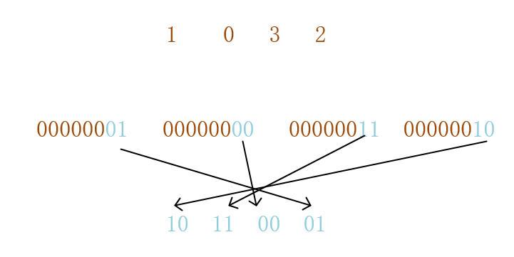
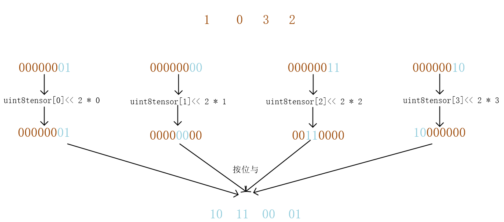
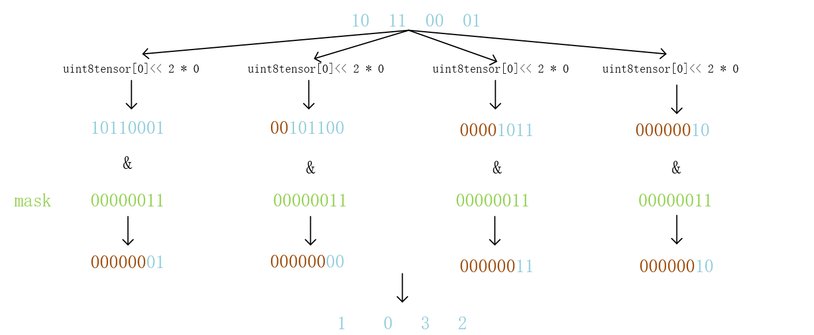

# packing and unpacking
## 一、为什么需要weights packing
假定我们量化后的数据是2bit，2bit取值就是 0,1,2,3。现在用torch存储这些数，我们想定义

`tensor = torch.tensor([1, 0, 3, 2], dtype=torch.int2)`

但是torch不支持int2，如果我们用uint8存储

`tensor = torch.tensor([1, 0, 3, 2], dtype=torch.uint8)`

则理论上需要的存储空间为 2 bits * 4 = 8 bits
但实际上花费的存储空间为 8 bits * 4 = 32 bits

那既然uint8是8位，我们能否用uint8存储4个2bit呢?答案是肯定的，将4个2bit存储到一个uint8中的过程(概况的来说，就是将多个低bit数存储到高bit数中)，就是权重打包。


当然，我们也可以打包为01 00 11 10,这里是保持跟课程一致。
那么打包后，我们的tensor就是
`packed_tensor = torch.tensor([177], dtype=torch.uint8)`

## 二、实现weights packing
```python
def pack_weights(uint8tensor, bits):
    if uint8tensor.shape[0] * bits % 8 != 0:
        raise ValueError(f"The input shape needs to be a mutiple \
        of {8 / bits} - got {uint8tensor.shape[0]}")

    packed_tensor_size = uint8tensor.shape[0] * bits // 8
    num_steps = 8 // bits
    unpacked_idx = 0
    packed_tensor = torch.zeros((packed_tensor_size), dtype=torch.uint8)

    for i in range(packed_tensor_size):
        for j in range(num_steps):
            packed_tensor[i] |= uint8tensor[unpacked_idx] << (bits * j)
            unpacked_idx += 1
    return packed_tensor
```
打包过程如图：


## 三、实现weights unpacking
既然有权重打包，那就自然对应的有解包。
```python
def unpack_weights(uint8tensor, bits):
    unpackend_tensor_size = uint8tensor.shape[0] * 8 // bits
    num_steps = 8 // bits

    unpacked_tensor = torch.zeros((unpackend_tensor_size), dtype=torch.uint8)
    unpacked_idx = 0
    mask = 2 ** bits - 1

    for i in range(uint8tensor.shape[0]):
        for j in range(num_steps):
            unpacked_tensor[unpacked_idx] |= uint8tensor[i] >> (bits * j)
            unpacked_idx += 1

    unpacked_tensor &= mask
    return unpacked_tensor
```
解包过程如图：
