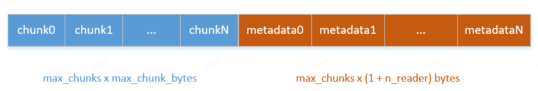

# 一、ShmRingBuffer
ShmRingBuffer 的存储结构如图：

- chunk存储实际的数据，有多少chunk就有多少个metadata， metadata用于标识对应的chunk是否可读、可写
- 每个chunk最大10MB，每个metadata最大（1+n_reader）Bytes
- 最多10个chunk
metadata的首字节是写标识，剩余的字节是读标识。所有标识的组合情况有以下几种：
- 1）0???...???:：表示该chunk还未被写，此时该chunk可写，不可读
- 2）1000...000：表示该 chunk 已经被写入，还没有被读取，此时可读，不可写。
- 3）1???...???：表示该chunk 已经被写入，部分被读取，此时未读取的可读，不可写
- 4）1111...111：表示该chunk已经被写入，全部被读取，此时可写不可读
# 二、MessageQueue
## 2.1 构造MessageQueue
MessageQueue有三种构造方式
- \_\_init\_\_ 
- create_from_handle
- create_from_process_group

区别在于\_\_init\_\_ 构造的MessageQueue 是zmq socket的服务端， create_from_handle构造的MessageQueue是zmq socket的客户端。
### 2.1.1 \_\_init\_\_
```
        context = Context()
        if n_local_reader > 0:
            # for local readers, we will:
            # 1. create a shared memory ring buffer to communicate small data
            # 2. create a publish-subscribe socket to communicate large data
            self.buffer = ShmRingBuffer(n_local_reader, max_chunk_bytes, max_chunks)
            self.local_socket.setsockopt(XPUB_VERBOSE, True)
            local_subscribe_addr = get_open_zmq_ipc_path()
            logger.debug("Binding to %s", local_subscribe_addr)
            self.local_socket.bind(local_subscribe_addr)

            self.current_idx = 0
        else:
            self.buffer = None  # type: ignore
            local_subscribe_addr = None
            self.local_socket = None
            self.current_idx = -1

        remote_addr_ipv6 = False
        if n_remote_reader > 0:
            # for remote readers, we will:
            # create a publish-subscribe socket to communicate large data
            if not connect_ip:
                connect_ip = get_ip()
            self.remote_socket = context.socket(XPUB)
            self.remote_socket.setsockopt(XPUB_VERBOSE, True)
            remote_subscribe_port = get_open_port()
            if is_valid_ipv6_address(connect_ip):
                self.remote_socket.setsockopt(IPV6, 1)
                remote_addr_ipv6 = True
                connect_ip = f"[{connect_ip}]"
            socket_addr = f"tcp://{connect_ip}:{remote_subscribe_port}"
            self.remote_socket.bind(socket_addr)
            remote_subscribe_addr = f"tcp://{connect_ip}:{remote_subscribe_port}"
        else:
            remote_subscribe_addr = None
            self.remote_socket = None
```
- 针对于local reader(单卡)，创建了ShmRingBuffer 和 zmq 来通信。
    数据小于10M使用ShmRingBuffer，大于等于10M使用zmq
- 针对于remote reader，使用zmq 通信
### 2.1.2 create_from_handle
```
    @staticmethod
    def create_from_handle(handle: Handle, rank) -> "MessageQueue":
        self = MessageQueue.__new__(MessageQueue)
        self.handle = handle
        self._is_writer = False

        context = Context()
        if rank in handle.local_reader_ranks:
            assert handle.buffer_handle is not None
            self.buffer = ShmRingBuffer(*handle.buffer_handle)
            self.current_idx = 0
            self.local_reader_rank = handle.local_reader_ranks.index(rank)
            self._is_local_reader = True
            self._is_remote_reader = False

            self.local_socket = context.socket(SUB)
            self.local_socket.setsockopt_string(SUBSCRIBE, "")
            socket_addr = handle.local_subscribe_addr
            logger.debug("Connecting to %s", socket_addr)
            self.local_socket.connect(socket_addr)

            self.remote_socket = None
        else:
            self.buffer = None  # type: ignore
            self.current_idx = -1
            self.local_reader_rank = -1
            self._is_local_reader = False
            self._is_remote_reader = True

            self.local_socket = None

            self.remote_socket = context.socket(SUB)
            self.remote_socket.setsockopt_string(SUBSCRIBE, "")
            if handle.remote_addr_ipv6:
                self.remote_socket.setsockopt(IPV6, 1)
            socket_addr = handle.remote_subscribe_addr
            logger.debug("Connecting to %s", socket_addr)
            self.remote_socket.connect(socket_addr)

        return self
```
根据 local_reader_ranks 来创建对应的 local reader 客户端和remote reader 客户端
## 2.2 enqueue
```
def enqueue(self, obj, timeout: Optional[float] = None):
    """ Write to message queue with optional timeout (in seconds) """
    assert self._is_writer, "Only writers can enqueue"
    serialized_obj = pickle.dumps(obj, protocol=pickle.HIGHEST_PROTOCOL)
    if self.n_local_reader > 0:
        if len(serialized_obj) >= self.buffer.max_chunk_bytes:
            with self.acquire_write(timeout) as buf:
                buf[0] = 1  # overflow
            self.local_socket.send(serialized_obj)
        else:
            with self.acquire_write(timeout) as buf:
                buf[0] = 0  # not overflow
                buf[1:len(serialized_obj) + 1] = serialized_obj
    if self.n_remote_reader > 0:
        self.remote_socket.send(serialized_obj)
```
如果入队数据大于10M，使用zmq socket，且使用buffer的第一个bit作为标识，设为1；如果小于10M，则使用ShmRingBuffer，第一个bit标识为0，从第二个bit开始存储数据。
```
acquire_write：
# case 3
if  written_flag  and  read_count != self.buffer.n_reader:
    yield()

# case 4
metadata_buffer[0] = 0
ShmRingBuffer.get_data(self.current_idx)
```
## 2.3 dequeue
```
def dequeue(self,
            timeout: Optional[float] = None,
            cancel: Optional[Event] = None):
    """ Read from message queue with optional timeout (in seconds) """
    if self._is_local_reader:
        with self.acquire_read(timeout, cancel) as buf:
            overflow = buf[0] == 1
            if not overflow:
                obj = pickle.loads(buf[1:])
        if overflow:
            obj = MessageQueue.recv(self.local_socket, timeout)
    elif self._is_remote_reader:
        obj = MessageQueue.recv(self.remote_socket, timeout)
    else:
        raise RuntimeError("Only readers can dequeue")
    return obj
```
拿到对应chunk的指针，如果第一个bit为0，则从ShmRingBuffer取数据；如果第一个bit为1，则从zmq从获取数据。
