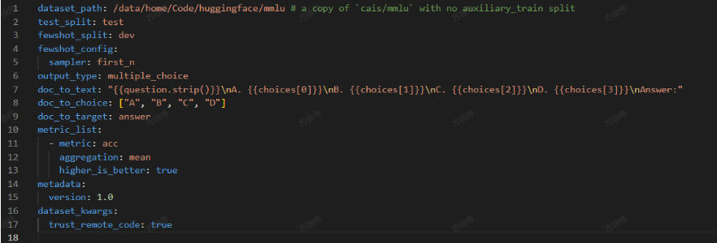

# lm_eval
lm-eval是一个开源的语言模型评估工具，支持多种评估指标和定量分析。
使用lm_eval的流程：  
1、安装 `pip install lm_eval`  
2、确定task, task信息参考[官方文档](https://github.com/EleutherAI/lm-evaluation-harness/blob/main/lm_eval/tasks/README.md)  
3、到huggingface下载task对应的数据集，下载数据集后，修改lm-eval 安装路径里的对应数据集的路径为本地路径，如 ~/miniforge/envs/vllm/lib/python3.12/site-packages/lm_eval/tasks/mmlu/default/_default_template_yaml 里的dataset_path.



4、使用lm_eval
```
lm_eval --model vllm \
        --model_args pretrained="./Qwen2.5-1.5B/",add_bos_token=true \
        --tasks mmlu
```
输出是：
```
|      Groups      |Version|Filter|n-shot|Metric|   |Value |   |Stderr|
|------------------|------:|------|------|------|---|-----:|---|-----:|
|mmlu              |      2|none  |      |acc   |↑  |0.5967|±  |0.0039|
| - humanities     |      2|none  |      |acc   |↑  |0.5356|±  |0.0067|
| - other          |      2|none  |      |acc   |↑  |0.6518|±  |0.0083|
| - social sciences|      2|none  |      |acc   |↑  |0.7078|±  |0.0080|
| - stem           |      2|none  |      |acc   |↑  |0.5252|±  |0.0086|