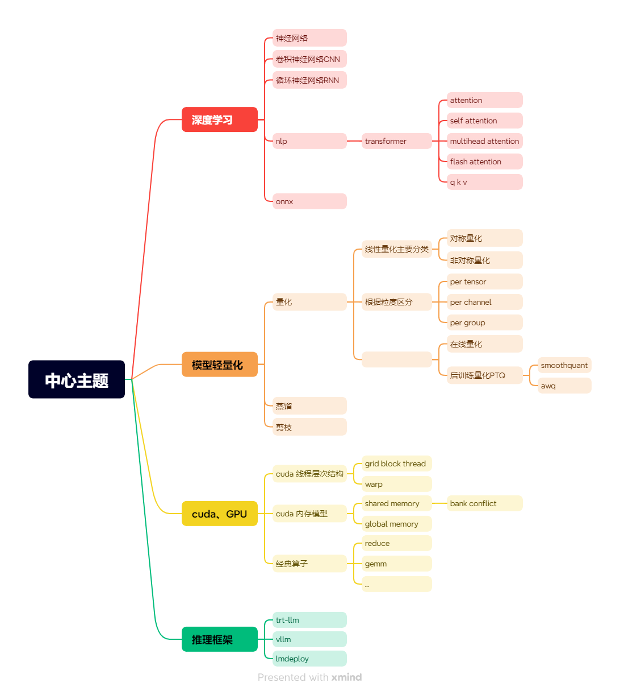

# InferEngine
本仓库是我对推理引擎相关技术的学习和总结。由于本人之前没有相关机器学习或深度学习相关经验，所以很多东西都是从小白的视角上开始着手。
大体分为以下几个方面：

1、深度学习
基本弄懂what,why,how这三个方面，暂不做深层次探究
参考链接：

2、模型轻量化
主要在量化，蒸馏和剪枝暂不涉及
参考链接：

3、CUDA
用CUDA实现基础算子
4、开源引擎
主要研究和使用trt-llm、vllm、lmdeploy